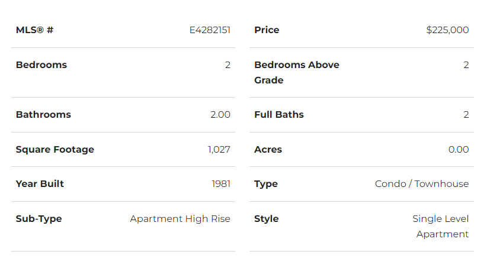

# apt_scraper

I created this project in mid 2020 when I was considering buying an apartment.

I was mostly interested in having a database of apartments. This way I could track which apartments I had already seen.

I also built in a way to track price changes.

## Key takeaways
As one of my first projects, most of this was done step-by-step using stack overflow and Google.

I continued to develop the skills that I learned with the lottery checking app: 
-I learned how to use selenium and chrome driver instead of beautiful soup 
-I coordinated my local environment with the environment on Heroku 
-I improved my database design by trying to update the records as I went through the listings 

